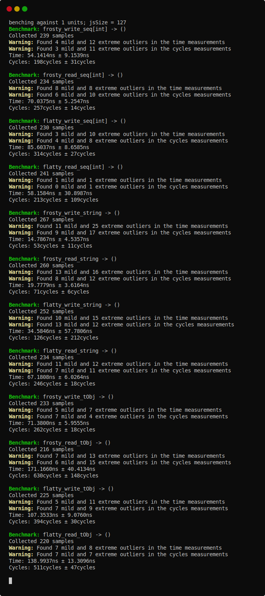

# frosty

[](https://github.com/disruptek/frosty/actions?query=workflow%3ACI)
[](https://github.com/disruptek/frosty/releases/latest)

[](#license)
[](https://www.buymeacoffee.com/disruptek)

Serialize native Nim objects to strings, streams, or sockets.

## Goals

Making some assumptions (ie. that our types aren't changing) allows...

- predictably fast performance
- predictably mild memory behavior
- predictably _idiomatic_ API
- **hard to misuse**

## Performance

Frosty _can_ handle cyclic data structures, but **not** memory graphs
of extreme size -- you can exhaust the stack because our traversal is
implemented via recursion. This will be solved soon. [Benchmarks are available
below.](https://github.com/disruptek/frosty#benchmarks).

## Example

It currently looks like this:

```nim
import frosty

var
  data = someArbitraryDataFactory()
  handle = openFileStream("somefile", fmWrite)
freeze(data, handle)
close handle
```

and then

```nim
import frosty

var
  data: SomeArbitraryType
  handle = openFileStream("somefile", fmRead)
thaw(handle, data)
close handle
```

or simply

```nim
import frosty

var brrr = freeze("my data")
assert thaw[string](brrr) == "my data"
```

## Benchmarks

[The source to the benchmark is found in the tests directory.](https://github.com/disruptek/frosty/blob/master/tests/bench.nim)




## Installation

```
$ nimph clone disruptek/frosty
```
or if you're still using Nimble like it's 2012,
```
$ nimble install https://github.com/disruptek/frosty
```

## Documentation

[The documentation employs Nim's `runnableExamples` feature to
ensure that usage examples are guaranteed to be accurate. The
documentation is rebuilt during the CI process and hosted on
GitHub.](https://disruptek.github.io/frosty/frosty.html)

## License
MIT
