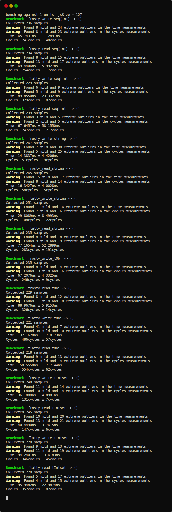

# frosty

[](https://github.com/disruptek/frosty/actions?query=workflow%3ACI)
[](https://github.com/disruptek/frosty/releases/latest)

[](#license)
[](https://www.buymeacoffee.com/disruptek)

Serialize native Nim types to strings, streams, or sockets.

## Usage

There are two operations: `freeze` and `thaw`.

#### `freeze[T](input: T; output: Socket or Stream or var string)`
```nim
import frosty

var
  data = someArbitraryDataFactory()
  handle = openFileStream("somefile", fmWrite)
# write serialized data into the file handle
freeze(data, handle)
close handle
```

#### `thaw[T](input: Socket or Stream or string; output: var T)`
```nim
import frosty

var
  data: SomeArbitraryType
  handle = openFileStream("somefile", fmRead)
# read deserialized data from the file handle
thaw(handle, data)
close handle
```

#### `freeze[T](input: T): string`
#### `thaw[T](input: Socket or Stream or string): T`
```nim
import frosty

# adhoc serialization and deserialization
var brrr = freeze("my data")
assert thaw[string](brrr) == "my data"
```

## Performance

Frosty _can_ handle cyclic data structures, but **not** memory graphs
of extreme size -- you can exhaust the stack because our traversal is
implemented via recursion. This will be solved soon.

[The source to the following benchmark is found in the tests directory.](https://github.com/disruptek/frosty/blob/master/tests/bench.nim)




## Installation

```
$ nimph clone disruptek/frosty
```
or if you're still using Nimble like it's 2012,
```
$ nimble install https://github.com/disruptek/frosty
```

## Options

- `--define:frostySorted=off` to use the standard library's `Table` type instead of Miran's `sorta` B-Trees.

## Documentation

[The documentation employs Nim's `runnableExamples` feature to
ensure that usage examples are guaranteed to be accurate. The
documentation is rebuilt during the CI process and hosted on
GitHub.](https://disruptek.github.io/frosty/frosty.html)

## License
MIT
